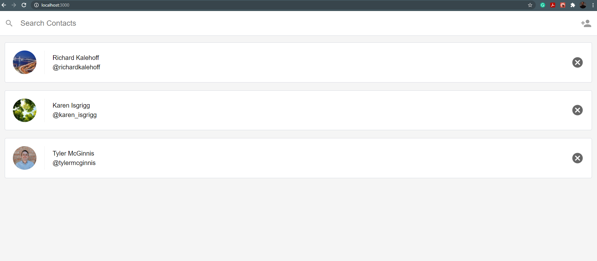
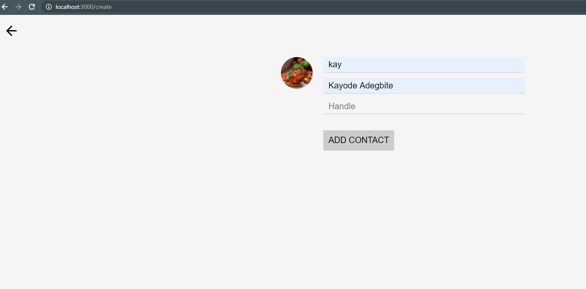
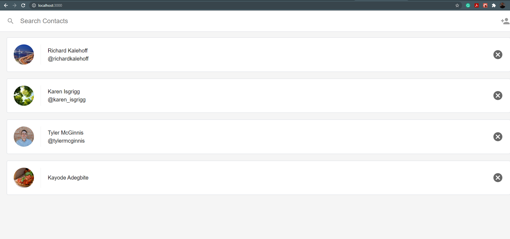

# Contact App

This project is about Creating, Reading, and Deleting contacts. This app was completed using Reactjs. Some API calls were done to the backend to retrive and store the contact. 

I created component to display the contacts. I also used BrowserRouter to keep track of the URL.

| **Screenshots**  | **Screenshots Contd**|
|------------|------------|
|  _List of Contacts_ |  _creating New Contact_ |
|  _Displaying All Contact_|  _Searching for contacts_ |
|  *Watch 30 seconds Demostration of the Application* *=>* | [VIDEO DEMOSTRATION OF THE APPLICATION](img/contactAppVideo.webm) _Demo_ |

## Project Setup

* install the dependencies - `npm install`
