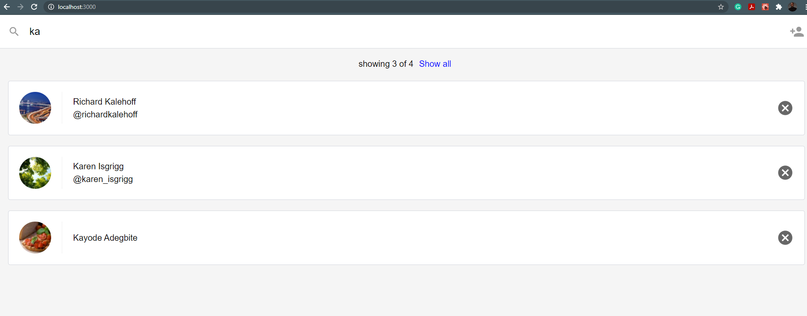

# Contact App

This project is about Creating, Reading, and Deleting contacts. This app was completed using Reactjs. Some API calls were done to the backend to retrive and store the contact. 

I created component to display the contacts. I also used BrowserRouter to keep track of the URL.

| **Screenshots**  | **Screenshots Contd**|
|------------|------------|
|  _List of Contacts_ |  _creating New Contact_ |
|  _Displaying All Contact_|  _Searching for contacts_ |
|  _Watch 30 seconds Demostration of the Application *=>*_ | [video](img/contactAppVideo.web,) _Demo_ |

## Project Setup

* clone the Project - `git clone https://github.com/udacity/reactnd-contacts-complete.git`
* install the dependencies - `npm install`

## Contributing

Because this is a code-along project and the commits correspond to specific videos in the program, we will not be accepting pull requests.

If you feel like there's a major problem, please open an issue to discuss the problem and potential resolution.

## Contributing

MIT
